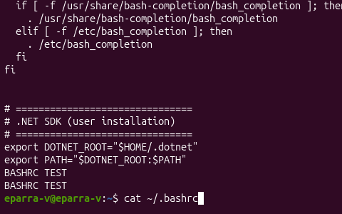

# Install the .NET CLI

**Official sites**

- https://dot.net
- https://dotnet.microsoft.com/en-us/download

## Prerequisites

- `curl` or `wget`
- A POSIX shell (bash, zsh, etc.)
- Write access to your chosen install directory
- For system-wide installs, prefer your distro package manager

## Download the official installer (choose one)

```bash
# using wget
wget https://dot.net/v1/dotnet-install.sh -O dotnet-install.sh

# using curl
curl -L https://dot.net/v1/dotnet-install.sh -o dotnet-install.sh
```

## Make the script executable and run it

```bash
chmod +x ./dotnet-install.sh

# Install latest SDK (user install default: ~/.dotnet)
./dotnet-install.sh --version latest

# Install latest ASP.NET Core runtime only
./dotnet-install.sh --version latest --runtime aspnetcore

# Install a specific channel (example: 9.0)
./dotnet-install.sh --channel 9.0
```

## Useful flags

```
--install-dir /path/to/dir   # change installation directory (recommended for non-root installs)
--architecture x64|arm64     # force a specific architecture
--runtime <runtime>          # e.g. aspnetcore, dotnet
--version <version>          # explicit version instead of 'latest'
```

## Add to PATH and set DOTNET_ROOT (example for user install)


```bash
export DOTNET_ROOT="$HOME/.dotnet"
export PATH="$PATH:$HOME/.dotnet"
# Add to ~/.bashrc, ~/.profile or appropriate shell rc to persist
```

## Add to ~/.profile (login shells)


```bash
# Load bashrc for interactive shells
if [ -n "$BASH_VERSION" ]; then
  if [ -f "$HOME/.bashrc" ]; then
    . "$HOME/.bashrc"
  fi
fi
```

If you want `DOTNET_ROOT` and `PATH` set for **login shells** (graphical sessions, SSH, etc.), add these lines to `~/.profile`:

```bash
# .NET SDK (user installation) — for login shells
export DOTNET_ROOT="$HOME/.dotnet"
export PATH="$DOTNET_ROOT:$PATH"
```

## Verify the installation

```bash
dotnet --info
which dotnet
```

## Security & best practices

> Inspect downloaded scripts before running, and avoid running unreviewed scripts as root.
> For system-wide installation and auto-updates, prefer the official distro packages (see Microsoft docs for Linux install instructions).

## Troubleshooting

- 'dotnet: command not found' -> check DOTNET_ROOT and PATH, or re-open the shell.
- Missing native dependencies -> install distro packages (common: libssl, libicu).
- Permission issues -> use --install-dir to choose a user-writable path or use package manager.

## References

- Installer scripts and docs: https://docs.microsoft.com/dotnet/core/tools/dotnet-install-script
- Official downloads: https://dotnet.microsoft.com/
