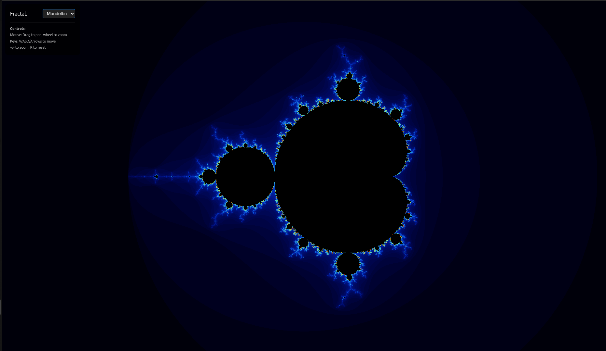
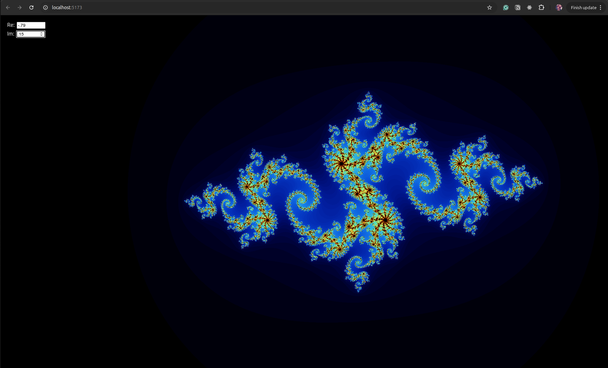
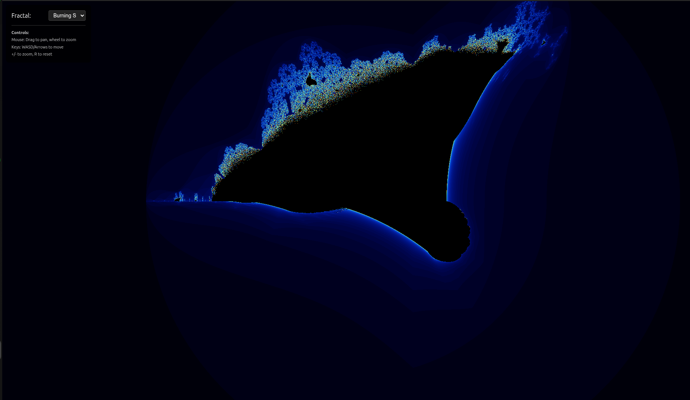

# Fractal Explorer

A JavaScript fractal generator that renders beautiful mathematical fractals in real-time using HTML5 Canvas.

## Features

- **Multiple Fractal Types**: Mandelbrot Set, Julia Set, and Burning Ship
- **Real-time Rendering**: Interactive parameter controls with live updates
- **Custom Color Gradients**: Beautiful color schemes for fractal visualization
- **Responsive Canvas**: Full-screen rendering that adapts to window size
- **Modular Architecture**: Clean, extensible codebase with parameter macros

## Demo


## Supported Fractals

### Mandelbrot Set



The classic Mandelbrot set with customizable iteration depth.

### Julia Set



Interactive Julia sets with adjustable complex constant parameters.

### Burning Ship



The distinctive "Burning Ship" fractal with unique ship-like formations.

## Installation

1. Clone the repository:

```bash
git clone <repository-url>
cd fractal-js
```

2. Install dependencies:

```bash
npm install
```

3. Start the development server:

```bash
npm run dev
```

4. Open your browser to `http://localhost:5173`

## Usage

### Basic Controls

- **Real/Imaginary**: Adjust the complex constant for Julia sets
- **Iterations**: Control calculation depth (higher = more detail, slower render)
- **Canvas**: Click and drag to explore different regions (future feature)

### HTML Setup

Add control elements to your HTML:

```html
<div id="controls">
  <label>
    Real: <input type="number" id="real" value="-0.7" step="0.01" />
  </label>
  <label>
    Imaginary: <input type="number" id="imag" value="0.27015" step="0.01" />
  </label>
</div>
```

## Project Structure

```
fractal-js/
├── src/
│   ├── core/                 # Core fractal engine
│   │   ├── coordinates.js    # Pixel-to-complex mapping
│   │   ├── engine.js         # Fractal computation engine
│   │   ├── paramMacros.js    # Parameter definition helpers
│   │   └── renderer.js       # Canvas rendering system
│   ├── fractals/            # Fractal implementations
│   │   ├── index.js         # Fractal registry
│   │   ├── mandelbrot.js    # Mandelbrot set
│   │   ├── julia.js         # Julia set
│   │   └── burningShip.js   # Burning Ship fractal
│   ├── utils/               # Utility functions
│   │   └── dom.js          # DOM interaction helpers
│   ├── main.js             # Application entry point
│   └── style.css           # Styling
├── images/                 # Screenshots and demos
├── index.html             # HTML template
└── README.md              # Project documentation
```

## API Reference

### Core Functions

#### `createCoordinates(options)`

Creates a coordinate system for mapping pixels to the complex plane.

```javascript
const coords = createCoordinates({
  center: { x: -0.5, y: 0 },
  scale: 3.0,
});
```

#### `computeFractal(config)`

Computes fractal data for each pixel.

```javascript
computeFractal({
  width: 800,
  height: 600,
  coordinates,
  fractal: fractals.julia,
  parameters: { maxIterations: 200, cReal: -0.7, cImag: 0.27 },
  buffer,
});
```

### Parameter Macros

#### `NUMBER({ min, max, defaultValue })`

Creates a numeric parameter with bounds.

#### `ITERATIONS(defaultValue)`

Fractal iteration depth parameter (10-5000).

#### `REAL(defaultValue)`

Real number parameter for coordinates (-2 to 2).

#### `COMPLEX_C({ real, imag })`

Complex constant for Julia sets.

## Adding New Fractals

1. Create a new fractal file in `src/fractals/`:

```javascript
// src/fractals/myFractal.js
import { ITERATIONS } from "../core/paramMacros.js";

export const MyFractal = {
  name: "My Fractal",
  schema: {
    ...ITERATIONS(100),
  },

  iterate(x, y, maxIterations, params) {
    // Your fractal algorithm here
    let i = 0;
    // ... computation logic
    return i;
  },
};
```

2. Register it in `src/fractals/index.js`:

```javascript
import { MyFractal } from "./myFractal.js";

export const fractals = {
  // existing fractals...
  myFractal: MyFractal,
};
```

## Performance Tips

- Lower iteration counts for real-time interaction
- Higher iteration counts for final high-quality renders
- Canvas size affects render time significantly
- Consider Web Workers for complex fractals (future enhancement)

## Browser Support

- Modern browsers with ES6+ support
- HTML5 Canvas support required
- Tested on Chrome, Firefox, Safari, Edge

## Contributing

1. Fork the repository
2. Create a feature branch: `git checkout -b feature-name`
3. Commit changes: `git commit -am 'Add feature'`
4. Push to branch: `git push origin feature-name`
5. Submit a Pull Request

## License

MIT License - see LICENSE file for details

## Acknowledgments

- Fractal mathematics and algorithms
- HTML5 Canvas rendering techniques
- Modern JavaScript ES6+ features
