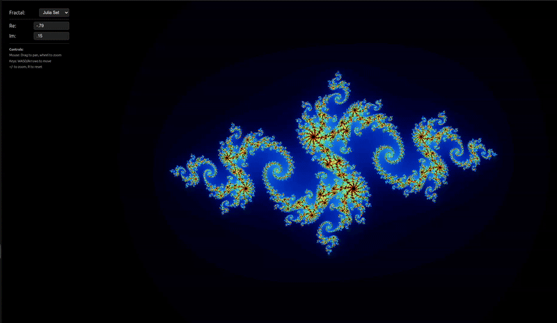

# Fractal Explorer

A JavaScript fractal generator that renders beautiful mathematical fractals in real-time using HTML5 Canvas with full interactive navigation.

## Features

- **Multiple Fractal Types**: Mandelbrot Set, Julia Set, and Burning Ship
- **Interactive Navigation**: Mouse drag to pan, wheel to zoom, keyboard controls
- **Real-time Rendering**: Live parameter updates with smooth performance
- **Dynamic Fractal Switching**: Dropdown selection between fractal types
- **Custom Color Gradients**: Beautiful color schemes for fractal visualization
- **Responsive Canvas**: Full-screen rendering that adapts to window size
- **Modular Architecture**: Clean, extensible codebase with parameter macros

## Demo



## Interactive Controls

### Mouse Controls

- **Drag to Pan**: Click and drag to explore different regions
- **Mouse Wheel**: Scroll to zoom in/out smoothly
- **Visual Feedback**: Cursor changes during interactions

### Keyboard Controls

- **WASD / Arrow Keys**: Continuous movement in all directions
- **+ / = Keys**: Zoom in
- **- Key**: Zoom out
- **R Key**: Reset view to default position

## Supported Fractals

### Mandelbrot Set


The classic Mandelbrot set with customizable iteration depth and full navigation.

### Julia Set


Interactive Julia sets with adjustable complex constant parameters (Real and Imaginary components).

### Burning Ship


The distinctive "Burning Ship" fractal with unique ship-like formations and exploration capabilities.

## Installation

1. Clone the repository:

```bash
git clone <repository-url>
cd fractal-js
```

2. Install dependencies:

```bash
npm install
```

3. Start the development server:

```bash
npm run dev
```

4. Open your browser to `http://localhost:5173`

## Usage

### Basic Controls

- **Fractal Selection**: Choose between Mandelbrot, Julia, or Burning Ship using the dropdown
- **Real/Imaginary**: Adjust the complex constant for Julia sets (dynamically shown/hidden)
- **Interactive Navigation**: Use mouse and keyboard to explore fractal regions
- **Smooth Rendering**: Real-time updates with loading state feedback

### Complete HTML Setup

The application includes a full control panel:

```html
<div id="controls">
  <label>
    Fractal:
    <select id="fractal-select">
      <option value="mandelbrot">Mandelbrot Set</option>
      <option value="julia">Julia Set</option>
      <option value="burningShip">Burning Ship</option>
    </select>
  </label>

  <div class="julia-controls">
    <label>
      Re: <input id="real" type="number" step="0.01" value="-0.7" />
    </label>
    <label>
      Im: <input id="imag" type="number" step="0.01" value="0.27015" />
    </label>
  </div>

  <div class="help">
    <small>
      <strong>Controls:</strong><br />
      Mouse: Drag to pan, wheel to zoom<br />
      Keys: WASD/Arrows to move<br />
      +/- to zoom, R to reset
    </small>
  </div>
</div>
```

## Project Structure

```
fractal-js/
├── src/
│   ├── core/                 # Core fractal engine
│   │   ├── coordinates.js    # Pixel-to-complex mapping
│   │   ├── engine.js         # Fractal computation engine
│   │   ├── paramMacros.js    # Parameter definition helpers
│   │   └── renderer.js       # Canvas rendering with color gradients
│   ├── fractals/            # Fractal implementations
│   │   ├── index.js         # Fractal registry
│   │   ├── mandelbrot.js    # Mandelbrot set
│   │   ├── julia.js         # Julia set
│   │   └── burningShip.js   # Burning Ship fractal
│   ├── utils/               # Utility functions
│   │   ├── dom.js          # DOM interaction helpers
│   │   └── inputs.js       # Mouse/keyboard input handling
│   ├── main.js             # Application entry point
│   └── style.css           # Professional styling with dark theme
├── images/                 # Screenshots and demos
├── index.html             # Complete HTML template
├── package.json           # Vite configuration
└── README.md              # Project documentation
```

## API Reference

### Core Functions

#### `createCoordinates(options)`

Creates a coordinate system for mapping pixels to the complex plane with interactive navigation.

```javascript
const coords = createCoordinates({
  center: { x: -0.5, y: 0 },
  scale: 3.0,
});
```

#### `computeFractal(config)`

Computes fractal data for each pixel with optimized performance.

```javascript
computeFractal({
  width: 800,
  height: 600,
  coordinates,
  fractal: fractals.julia,
  parameters: { maxIterations: 200, cReal: -0.7, cImag: 0.27 },
  buffer,
});
```

#### `createInputHandler(canvas, coordinates, onUpdate)`

Sets up comprehensive mouse and keyboard interaction.

```javascript
const cleanup = createInputHandler(canvas, coordinates, render);
// Returns cleanup function for proper event management
```

#### `createRenderer(canvas)`

Creates canvas renderer with beautiful color gradients.

```javascript
const renderer = createRenderer(canvas);
renderer.resize();
renderer.render(buffer, maxIterations);
```

### Parameter Macros

#### `NUMBER({ min, max, defaultValue })`

Creates a numeric parameter with bounds validation.

#### `ITERATIONS(defaultValue)`

Fractal iteration depth parameter (10-5000 range).

#### `REAL(defaultValue)`

Real number parameter for coordinates (-2 to 2 range).

#### `COMPLEX_C({ real, imag })`

Complex constant for Julia sets with real and imaginary components.

## Adding New Fractals

1. Create a new fractal file in `src/fractals/`:

```javascript
// src/fractals/myFractal.js
import { ITERATIONS } from "../core/paramMacros.js";

export const MyFractal = {
  name: "My Fractal",
  schema: {
    ...ITERATIONS(100),
  },

  iterate(x, y, maxIterations, params) {
    // Your fractal algorithm here
    let i = 0;
    // ... computation logic
    return i;
  },
};
```

2. Register it in `src/fractals/index.js`:

```javascript
import { MyFractal } from "./myFractal.js";

export const fractals = {
  mandelbrot: Mandelbrot,
  julia: Julia,
  burningShip: BurningShip,
  myFractal: MyFractal, // Add your new fractal
};
```

3. Add option to HTML dropdown (optional - can be done dynamically):

```html
<option value="myFractal">My Fractal</option>
```

## Performance Features

- **Optimized Rendering**: Uses requestAnimationFrame for smooth updates
- **Smart Buffer Management**: Automatic resize handling
- **Loading State Feedback**: Visual indicators during computation
- **Debounced Rendering**: Prevents multiple simultaneous renders
- **Memory Management**: Proper event cleanup on page unload

## Performance Tips

- Lower iteration counts (50-100) for real-time interaction
- Higher iteration counts (200-1000) for detailed exploration
- Canvas size directly affects render time
- Use keyboard controls for smooth continuous movement
- Consider Web Workers for complex fractals (future enhancement)

## Browser Support

- Modern browsers with ES6+ module support
- HTML5 Canvas with 2D context required
- Mouse and keyboard event support
- Tested on Chrome, Firefox, Safari, Edge

## Navigation Guide

### Quick Start

1. Select a fractal type from the dropdown
2. For Julia sets, adjust Real/Imaginary parameters
3. Use mouse to drag and explore
4. Use mouse wheel or +/- keys to zoom
5. Press 'R' to reset view anytime

### Advanced Navigation

- **Smooth Movement**: Hold WASD or arrow keys for continuous panning
- **Precise Zoom**: Use +/- keys for controlled zoom levels
- **Quick Reset**: Press 'R' to return to default view
- **Parameter Adjustment**: Change Julia set constants in real-time

## Contributing

1. Fork the repository
2. Create a feature branch: `git checkout -b feature-name`
3. Commit changes: `git commit -am 'Add feature'`
4. Push to branch: `git push origin feature-name`
5. Submit a Pull Request

## Technical Architecture

### Key Improvements Made

- **Interactive Input System**: Complete mouse and keyboard navigation
- **Dynamic UI**: Fractal-specific controls that show/hide appropriately
- **Smooth Rendering**: Optimized update cycle with visual feedback
- **Professional Styling**: Dark theme with backdrop blur effects
- **Modular Design**: Easy to extend with new fractals and features

## License

MIT License - see LICENSE file for details

## Acknowledgments

- Fractal mathematics and algorithms research
- HTML5 Canvas rendering techniques
- Modern JavaScript ES6+ features and module system
- Interactive mathematical visualization principles
- Real-time graphics programming patterns
